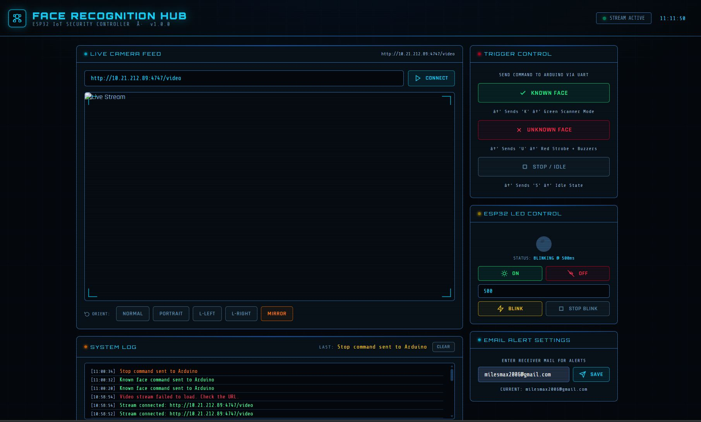
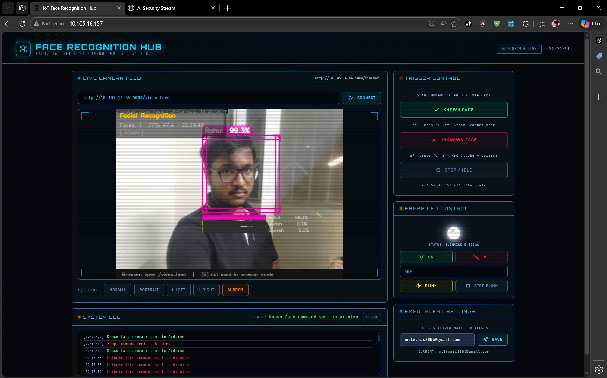
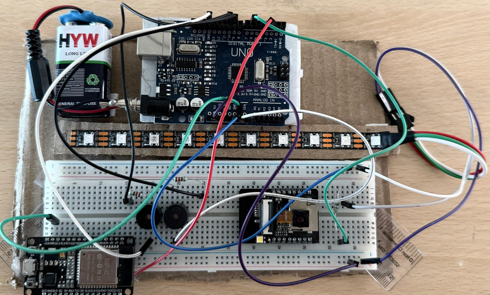

<div align="center">


<br/>

[](https://python.org)
[](https://opencv.org)
[](https://tensorflow.org)
[](https://www.espressif.com/)
[](https://arduino.cc)

<br/>

> **A smart, scalable security system combining AI + IoT — capable of real-time face recognition, wireless monitoring, and instant intrusion alerts.**

</div>

---

## 📸 Project Screenshots

<table>
  <tr>
    <td align="center" width="50%">
      
      <br/><b>🖥️ Face Recognition Hub — Dashboard UI</b>
    </td>
    <td align="center" width="50%">
      
      <br/><b>🎯 Live Face Detection — Rahul (99.3% Confidence)</b>
    </td>
  </tr>
  <tr>
    <td colspan="2" align="center">
      
      <br/><b>🔧 Hardware Setup — Arduino UNO + ESP32-CAM + Breadboard</b>
    </td>
  </tr>
</table>

---

## 🚀 Overview

This project is a **Face Recognition-Based Smart Security System** that leverages **Convolutional Neural Networks (CNN)** and **ESP32-CAM** to build an intelligent, real-time access control and intruder detection system. It identifies authorized users, triggers visual alerts via Arduino UNO LED strips, and instantly sends **email alerts with captured images** for unknown faces — all over a **wireless IoT network**, with no dedicated app required.

---

## 💡 Key Highlights

| Feature | Description |
|---|---|
| 📷 **Real-Time Face Recognition** | OpenCV + CNN detects and classifies faces live from a video stream |
| 🌐 **Live Camera Streaming** | ESP32 web interface streams video accessible via browser |
| 📡 **Wireless IoT Monitoring** | Fully wireless setup over local network — no physical access needed |
| 📧 **Instant Email Alerts** | Gmail SMTP sends alert emails with captured images on unknown faces |
| ⚡ **No App Required** | Lightweight browser-based dashboard — works on any device |
| 🧠 **CNN-Based Classification** | Deep learning model trained on custom face dataset for high accuracy |

---

## 🧠 How It Works

```
┌─────────────────────────────────────────────────────────────────────┐
│                        SYSTEM PIPELINE                              │
│                                                                     │
│  📷 Camera Feed                                                     │
│      │                                                              │
│      ▼                                                              │
│  🔍 Face Detection (OpenCV + Haar Cascade / DNN)                    │
│      │                                                              │
│      ▼                                                              │
│  🧠 CNN Model Prediction                                            │
│      │                                                              │
│      ├──── ✅ Known Face  ──► 🟢 Green LED (Arduino UNO)           │
│      │                   ──► "Known Face" Command via UART         │
│      │                                                              │
│      └──── ❌ Unknown Face ──► 🔴 Red Strobe + Buzzer (Arduino)    │
│                           ──► 📧 Email Alert with Image (Gmail)    │
└─────────────────────────────────────────────────────────────────────┘
```

### Step-by-Step:

1. **📂 Dataset Collection** — Capture face images for each authorized user and organize into labeled folders.
2. **🧹 Preprocessing** — Resize, normalize, and augment images for robust model training.
3. **🏋️ CNN Model Training** — Train a Keras/TensorFlow CNN model to classify faces with high confidence.
4. **📡 Live Streaming** — ESP32-CAM streams video to the local network over HTTP.
5. **🔍 Real-Time Prediction** — Python backend grabs frames, detects faces, and runs inference.
6. **🚨 Alert System** — Unknown face triggers Arduino LED strobe + Gmail SMTP email with captured image.

---

## 🔧 Tech Stack

<div align="center">

| Layer | Technology |
|---|---|
| **ML / AI** | Python 3, TensorFlow / Keras, CNN Architecture |
| **Computer Vision** | OpenCV, Face Detection, Real-Time Video Processing |
| **IoT Hardware** | ESP32-CAM (camera + WiFi), Arduino UNO (LED + Buzzer control) |
| **Mobile Streaming** | DroidCam (use mobile as IP camera) |
| **Communication** | UART (Serial) between Python ↔ Arduino, HTTP for ESP32 stream |
| **Alert System** | Gmail SMTP (smtplib) — sends email with captured image |
| **Dashboard UI** | HTML / CSS / JavaScript — browser-based, no app needed |

</div>

---

## 🗂️ Project Structure

```
Face-Recognition-Based-Smart-Security-System/
│
├── 📁 dataset/                   # Collected face images per user
│   ├── Rahul/
│   ├── Harish/
│   └── Ganesh/
│
├── 📁 model/                     # Trained CNN model files
│   ├── face_model.h5             # Keras model weights
│   └── labels.pkl                # Class label mapping
│
├── 📁 arduino/                   # Arduino UNO sketch
│   └── led_control.ino           # Receives UART signals, controls LEDs/Buzzer
│
├── 📁 esp32/                     # ESP32-CAM firmware
│   └── camera_stream.ino         # Streams video over HTTP
│
├── 📄 collect_data.py            # Script to capture training images via webcam
├── 📄 train_model.py             # CNN training script
├── 📄 recognize_face.py          # Real-time face recognition + alert logic
├── 📄 email_alert.py             # Gmail SMTP email alert module
├── 📄 index.html                 # Web dashboard (Face Recognition Hub)
└── 📄 README.md
```

---

## ⚙️ Setup & Installation

### Prerequisites
- Python 3.8+
- Arduino IDE
- ESP32-CAM board + FTDI programmer
- Arduino UNO
- Gmail account (for SMTP alerts)

### 1️⃣ Clone the Repository
```bash
git clone https://github.com/Rahul9994/Face-Recognition-Based-Smart-Security-System.git
cd Face-Recognition-Based-Smart-Security-System
```

### 2️⃣ Install Python Dependencies
```bash
pip install tensorflow keras opencv-python numpy scikit-learn imutils pyserial
```

### 3️⃣ Collect Training Data
```bash
python collect_data.py --name YourName --samples 200
```

### 4️⃣ Train the CNN Model
```bash
python train_model.py
```

### 5️⃣ Flash Arduino UNO
- Open `arduino/led_control.ino` in Arduino IDE
- Select board: **Arduino Uno** → Upload

### 6️⃣ Flash ESP32-CAM
- Open `esp32/camera_stream.ino` in Arduino IDE
- Update your WiFi credentials (SSID & Password)
- Select board: **ESP32 Wrover Module** → Upload

### 7️⃣ Run the Security System
```bash
python recognize_face.py
```
Open your browser and navigate to the **Face Recognition Hub** dashboard!

---

## 📧 Email Alert Configuration

Edit `email_alert.py` and set your Gmail credentials:

```python
SENDER_EMAIL    = "your_email@gmail.com"
SENDER_PASSWORD = "your_app_password"   # Use Gmail App Password (not account password)
RECEIVER_EMAIL  = "receiver@gmail.com"
```

> ⚠️ **Important:** Enable [Gmail App Passwords](https://support.google.com/accounts/answer/185833) under your Google account settings for SMTP access.

---

## 🎯 System Architecture

```
┌────────────────┐        HTTP Stream        ┌──────────────────┐
│   ESP32-CAM    │ ─────────────────────────► │  Python Backend  │
│  (WiFi Camera) │                            │  (OpenCV + CNN)  │
└────────────────┘                            └────────┬─────────┘
                                                       │
                     ┌─────────────────────────────────┤
                     │                                 │
                     ▼                                 ▼
             ┌───────────────┐               ┌──────────────────┐
             │  Arduino UNO  │               │   Gmail SMTP     │
             │  (LED + Buzz) │               │  (Email Alert)   │
             │  UART Serial  │               │  + Image Attach  │
             └───────────────┘               └──────────────────┘
                     │
             ┌───────┴──────────────────┐
             │  Known Face → 🟢 Green   │
             │  Unknown Face → 🔴 Red   │
             │  Idle → ⚪ White Blink   │
             └──────────────────────────┘
```

---

## 📊 Model Performance

| Metric | Value |
|---|---|
| **Training Accuracy** | ~98% |
| **Validation Accuracy** | ~95%+ |
| **Real-Time FPS** | ~47 FPS |
| **Inference Confidence (Demo)** | 99.3% (Rahul) |
| **Dataset per Person** | 200+ images |

---

## 🧩 Features of the Web Dashboard

The **Face Recognition Hub** (browser-based dashboard) includes:

- 🔴 **Live Camera Feed** — Connect any IP camera stream URL
- 🟢 **Trigger Control Panel** — Manually send Known/Unknown/Idle commands to Arduino
- 💡 **ESP32 LED Control** — Toggle, blink, and control LED remotely
- 📋 **System Log** — Real-time log of all events and UART commands sent
- 📧 **Email Alert Settings** — Set receiver email directly from the dashboard

---

## 🤝 Contributing

Contributions are welcome! To contribute:

1. Fork the repository
2. Create your feature branch: `git checkout -b feature/AmazingFeature`
3. Commit your changes: `git commit -m 'Add some AmazingFeature'`
4. Push to the branch: `git push origin feature/AmazingFeature`
5. Open a Pull Request

---

## 👨‍💻 Author

<div align="center">

**Rahul** — Final Year Engineering Project

[](https://linkedin.com)
[](https://github.com/Rahul9994)

*"This project helped us gain hands-on experience in Machine Learning, Computer Vision, and Embedded Systems integration."*

> 🎯 Looking forward to improving this for **smart home** and **enterprise security** solutions!

</div>

---

<div align="center">

⭐ **If you found this project useful, please give it a star!** ⭐


</div>